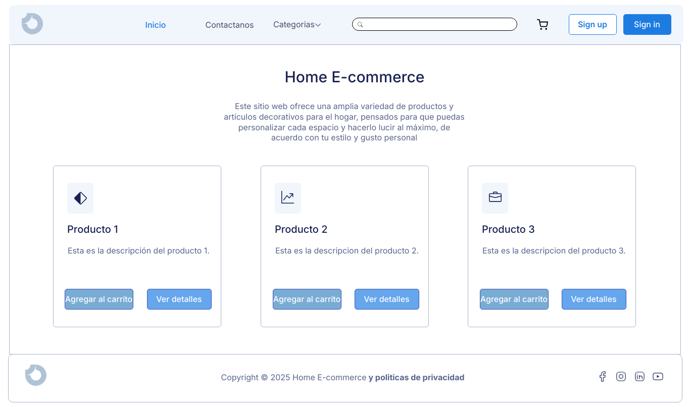
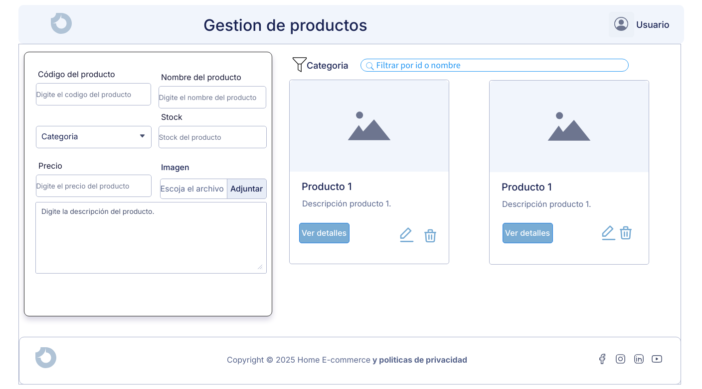

# Documentación inicial del proyecto
- Mi proyecto E-commerce se basa en la venta de productos decorativos para el hogar, tiene como nombre "Home E-commerce".

# Stack 🧨
- NestJS con TypeORM
- REACT con VITE
- Mysql

# Instalacion de dependendias
Realiza los siguientes pasos para inicializar el proyecto base:

- Clona el repositorio con: git clone https://github.com/angelhg34/Home_E-commerce
- Ahora entra a la carpeta: cd home_ecommerce_backend y digita el comando npm install, despúes digita npm run start:dev para inicializarlo
- Despúes entra a la carpeta: cd home_ecommerce_frontend y digita el comando npm install, despúes digita npm run dev para inicializarlo

## Muckups 🖼️

